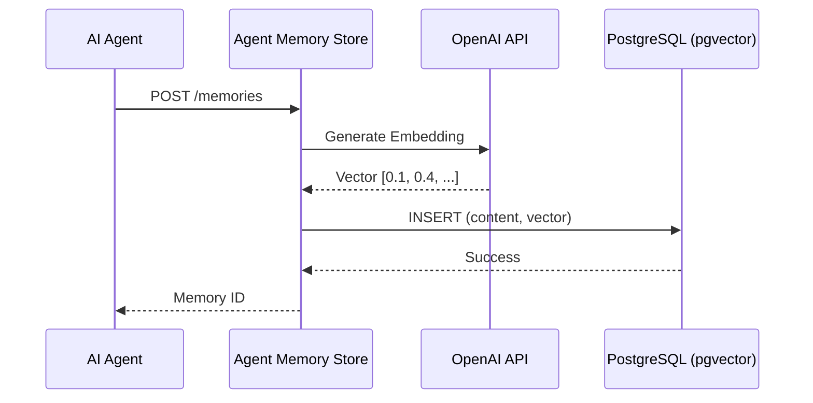

# Agent Memory Store

[](https://github.com/joaogabriel43/agent-memory-store/actions/workflows/ci.yml)

REST API providing **long-term memory for AI agents** using semantic search and pgvector.

Built with a Clean Architecture approach, this service allows AI agents to store, retrieve, and
consolidate memories using vector embeddings for semantic similarity search.

---

## Architecture Flow



---

## Tech Stack

| Component     | Technology                            |
|--------------|----------------------------------------|
| Language      | Java 21                               |
| Framework     | Spring Boot 3.2                       |
| Database      | PostgreSQL 16 + pgvector              |
| Batch         | Spring Batch 5                        |
| Resilience    | Resilience4j                          |
| AI Embeddings | Spring AI (OpenAI)                    |
| CI/CD         | GitHub Actions                        |

---

## How agents use this API

### 1. Store a Memory
Agents send observations or facts to be stored.

```bash
curl -X POST http://localhost:8080/api/v1/memories \
  -H "X-Tenant-Id: a1b2c3d4-e5f6-7890-abcd-ef1234567890" \
  -H "Content-Type: application/json" \
  -d '{"content": "The user prefers dark mode for IDEs."}'
```

### 2. Search Memories
Agents query the memory store using natural language to gain context.

```bash
curl -X GET "http://localhost:8080/api/v1/memories/search?query=IDE preferences&limit=5" \
  -H "X-Tenant-Id: a1b2c3d4-e5f6-7890-abcd-ef1234567890"
```

### 3. Check Memory Stats
Agents or administrators can check the health and counts of stored memories.

```bash
curl -X GET http://localhost:8080/api/v1/memories/stats \
  -H "X-Tenant-Id: a1b2c3d4-e5f6-7890-abcd-ef1234567890"
```

---

## Getting Started Locally

1. Start the database: `docker-compose up -d`
2. Build the project: `mvn clean install`
3. Run: `mvn spring-boot:run`

---

## Deployment (Railway)

To deploy this API on Railway, simply link your GitHub repository. Railway will detect the Maven build automatically (no `Procfile` required).

**Environment Variables Required:**
- `OPENAI_API_KEY`: Your OpenAI API Key.
- `SPRING_DATASOURCE_URL`: The JDBC URL pointing to your PostgreSQL instance. 
  *(Example: `jdbc:p6spy:postgresql://${{Postgres.PGHOST}}:${{Postgres.PGPORT}}/${{Postgres.PGDATABASE}}`)*
- `SPRING_DATASOURCE_USERNAME`: Database username.
- `SPRING_DATASOURCE_PASSWORD`: Database password.

> **Note:** Ensure you provision a PostgreSQL instance on Railway and run `CREATE EXTENSION IF NOT EXISTS vector;` if not already installed.

---

## CI/CD

The project includes a GitHub Actions security pipeline (`.github/workflows/ci.yml`) with:

- **SpotBugs** — Static analysis for bug patterns
- **OWASP Dependency-Check** — Known vulnerability scanning (fails on CVSS ≥ 7)
- **Trivy** — Filesystem vulnerability scan (CRITICAL severity)
- **Gitleaks** — Secret detection across git history

---

## License

This project is proprietary. All rights reserved.
